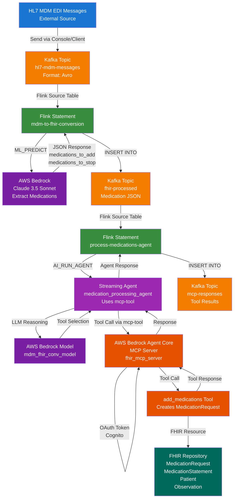

# Data Flow Diagram - HL7 MDM to FHIR Medication Processing

## Mermaid Diagram



## Architecture Overview

```
┌─────────────────────────────────────────────────────────────────────────────┐
│                         HL7 MDM to FHIR Processing Pipeline                  │
└─────────────────────────────────────────────────────────────────────────────┘

┌─────────────────┐
│  HL7 MDM EDI    │
│  Messages       │
│  (External)     │
└────────┬────────┘
         │
         │ Send via Confluent Console or test_client.py
         ▼
┌─────────────────────────────────────────────────────────────────────────────┐
│                         Confluent Cloud Kafka                               │
│                                                                             │
│  ┌─────────────────────────────────────┐                                   │
│  │  Topic: hl7-mdm-messages            │                                   │
│  │  Format: Avro                        │                                   │
│  │  Schema:                             │                                   │
│  │    - message_key: STRING             │                                   │
│  │    - edi_type: STRING                │                                   │
│  │    - edi_timestamp: STRING           │                                   │
│  │    - raw_edi_payload: STRING         │                                   │
│  └─────────────────────────────────────┘                                   │
└─────────────────────────────────────────────────────────────────────────────┘
         │
         │ Flink Source Table reads messages
         ▼
┌─────────────────────────────────────────────────────────────────────────────┐
│                    Confluent Flink Compute Pool                             │
│                                                                             │
│  ┌──────────────────────────────────────────────────────────────────────┐  │
│  │  Statement: mdm-to-fhir-conversion                                  │  │
│  │                                                                      │  │
│  │  ┌──────────────────┐         ┌──────────────────────────────┐   │  │
│  │  │  Source Table    │─────────▶│  ML_PREDICT                   │   │  │
│  │  │  hl7-mdm-messages│         │  (Bedrock AI Model)          │   │  │
│  │  └──────────────────┘         │  - Extract medications      │   │  │
│  │                                │  - medications_to_add[]       │   │  │
│  │                                │  - medications_to_stop[]     │   │  │
│  │                                └──────────────────────────────┘   │  │
│  │                                         │                           │  │
│  │                                         ▼                           │  │
│  │                                ┌──────────────────┐                │  │
│  │                                │  Sink Table      │                │  │
│  │                                │  fhir-processed  │                │  │
│  │                                └──────────────────┘                │  │
│  └──────────────────────────────────────────────────────────────────────┘  │
│                                                                             │
│  ┌──────────────────────────────────────────────────────────────────────┐  │
│  │  Statement: process-medications-agent                                │  │
│  │                                                                      │  │
│  │  ┌──────────────────┐         ┌──────────────────────────────┐   │  │
│  │  │  Source Table   │─────────▶│  AI_RUN_AGENT                │   │  │
│  │  │  fhir-processed │         │  (medication_processing_agent)│   │  │
│  │  └──────────────────┘         │  - Uses LATERAL TABLE         │   │  │
│  │                                │  - Agent reasons & calls tools│   │  │
│  │                                └──────────────────────────────┘   │  │
│  │                                         │                           │  │
│  │                                         ▼                           │  │
│  │                                ┌──────────────────┐                │  │
│  │                                │  Sink Table      │                │  │
│  │                                │  mcp-responses   │                │  │
│  │                                └──────────────────┘                │  │
│  └──────────────────────────────────────────────────────────────────────┘  │
└─────────────────────────────────────────────────────────────────────────────┘
         │
         │ Write medication extraction results
         ▼
┌─────────────────────────────────────────────────────────────────────────────┐
│                         Confluent Cloud Kafka                               │
│                                                                             │
│  ┌─────────────────────────────────────┐                                   │
│  │  Topic: fhir-processed               │                                   │
│  │  Format: Avro                        │                                   │
│  │  Schema:                             │                                   │
│  │    - message_key: STRING             │                                   │
│  │    - fhir_json: STRING               │                                   │
│  │      (medications_to_add,            │                                   │
│  │       medications_to_stop)           │                                   │
│  │    - processing_timestamp: TIMESTAMP │                                   │
│  └─────────────────────────────────────┘                                   │
└─────────────────────────────────────────────────────────────────────────────┘
         │
         │ Flink reads and processes with MCP tools
         ▼
┌─────────────────────────────────────────────────────────────────────────────┐
│                    Confluent Flink Compute Pool                             │
│                                                                             │
│  ┌──────────────────────────────────────────────────────────────────────┐  │
│  │  Streaming Agent: medication_processing_agent                        │  │
│  │                                                                      │  │
│  │  Model: mdm_fhir_conv_model                                         │  │
│  │  Tool: mcp-tool                                                      │  │
│  │    └─▶ Uses MCP Connection: agentcore-mcp-server-connection        │  │
│  │         └─▶ Allowed Tools: add_medications, stop_medications       │  │
│  │                                                                      │  │
│  │  Agent Flow:                                                         │  │
│  │  1. Receives medication JSON from prompt                            │  │
│  │  2. LLM reasons about which tool to use                             │  │
│  │  3. Extracts medications_to_add array                               │  │
│  │  4. Calls add_medications tool for each medication                   │  │
│  │  5. Returns aggregated tool responses                               │  │
│  └──────────────────────────────────────────────────────────────────────┘  │
└─────────────────────────────────────────────────────────────────────────────┘
         │
         │ OAuth Token (Cognito)
         │ HTTPS Request
         ▼
┌─────────────────────────────────────────────────────────────────────────────┐
│              AWS Bedrock Agent Core Runtime                                │
│                                                                             │
│  ┌──────────────────────────────────────────────────────────────────────┐  │
│  │  MCP Server: fhir_mcp_server                                         │  │
│  │  Endpoint: bedrock-agentcore.us-west-2.amazonaws.com                │  │
│  │  Protocol: MCP (Model Context Protocol)                             │  │
│  │  Transport: STREAMABLE_HTTP                                          │  │
│  │                                                                      │  │
│  │  ┌──────────────────────────────────────────────────────────────┐  │  │
│  │  │  Tool: add_medications                                        │  │  │
│  │  │  Input: MedicationRequest JSON                                │  │  │
│  │  │  Action: Creates MedicationRequest in FHIR store             │  │  │
│  │  │  Output: Created resource with ID                            │  │  │
│  │  └──────────────────────────────────────────────────────────────┘  │  │
│  │                                                                      │  │
│  │  ┌──────────────────────────────────────────────────────────────┐  │  │
│  │  │  FHIR Repository (In-Memory / Database)                       │  │  │
│  │  │  - MedicationRequest resources                                │  │  │
│  │  │  - MedicationStatement resources                             │  │  │
│  │  │  - Patient resources                                          │  │  │
│  │  │  - Observation resources                                     │  │  │
│  │  └──────────────────────────────────────────────────────────────┘  │  │
│  └──────────────────────────────────────────────────────────────────────┘  │
└─────────────────────────────────────────────────────────────────────────────┘
         │
         │ Tool response returned
         ▼
┌─────────────────────────────────────────────────────────────────────────────┐
│                    Confluent Flink Compute Pool                             │
│                                                                             │
│  ┌──────────────────────────────────────────────────────────────────────┐  │
│  │  Statement: process-medications-mcp                                  │  │
│  │                                                                      │  │
│  │  Writes tool response to sink table                                 │  │
│  └──────────────────────────────────────────────────────────────────────┘  │
└─────────────────────────────────────────────────────────────────────────────┘
         │
         │ Write MCP tool responses
         ▼
┌─────────────────────────────────────────────────────────────────────────────┐
│                         Confluent Cloud Kafka                               │
│                                                                             │
│  ┌─────────────────────────────────────┐                                   │
│  │  Topic: mcp-responses               │                                   │
│  │  Format: Avro                        │                                   │
│  │  Schema:                             │                                   │
│  │    - message_key: STRING             │                                   │
│  │    - input_medications_json: STRING   │                                   │
│  │    - tool_response: STRING           │                                   │
│  │      (MCP tool invocation result)   │                                   │
│  │    - processing_timestamp: TIMESTAMP │                                   │
│  └─────────────────────────────────────┘                                   │
└─────────────────────────────────────────────────────────────────────────────┘
```

## Detailed Data Flow

### Step 1: Input - HL7 MDM Messages
- **Source**: External systems or test client
- **Topic**: `hl7-mdm-messages`
- **Format**: Avro with schema:
  - `message_key`: Message identifier
  - `edi_type`: "HL7_MDM"
  - `edi_timestamp`: ISO timestamp
  - `raw_edi_payload`: HL7 MDM EDI message (pipe-delimited)

### Step 2: Medication Extraction
- **Flink Statement**: `mdm-to-fhir-conversion`
- **Process**:
  1. Reads from `hl7-mdm-messages` topic
  2. Uses `ML_PREDICT` with Bedrock AI model (`mdm_fhir_conv_model`)
  3. Prompt: Extract medications_to_add and medications_to_stop arrays
  4. Output: JSON with medication arrays in FHIR R4 format
- **Output Topic**: `fhir-processed`

### Step 3: Agent-Based Medication Processing
- **Flink Statement**: `process-medications-agent`
- **Agent**: `medication_processing_agent`
- **Process**:
  1. Reads from `fhir-processed` topic
  2. Uses `AI_RUN_AGENT` with `LATERAL TABLE` syntax
  3. Agent uses `mdm_fhir_conv_model` for LLM reasoning
  4. Agent has access to `mcp-tool` which exposes MCP server tools
  5. Agent extracts `medications_to_add` array from JSON
  6. Agent calls `add_medications` tool for each medication
  7. Tool invokes MCP server via OAuth (Cognito)
  8. Agent returns aggregated responses with status and response
- **Output Topic**: `mcp-responses`

### Step 4: MCP Server Processing
- **Location**: AWS Bedrock Agent Core Runtime
- **Endpoint**: `bedrock-agentcore.us-west-2.amazonaws.com/runtimes/{runtime-arn}/invocations`
- **Authentication**: OAuth 2.0 with Cognito (client credentials flow)
- **Tool**: `add_medications`
- **Action**: Creates MedicationRequest resources in FHIR repository
- **Response**: Returns created resource with ID

### Step 5: Response Storage
- **Topic**: `mcp-responses`
- **Content**: Tool invocation results, including success/failure and created resource IDs

## Components

### AWS Services
- **AWS Bedrock**: AI model inference (Claude 3.5 Sonnet)
- **AWS Bedrock Agent Core Runtime**: Hosts MCP server
- **AWS Cognito**: OAuth authentication for MCP server
- **AWS IAM**: Permissions for Bedrock and MCP server access

### Confluent Cloud
- **Kafka Cluster**: Message streaming
- **Flink Compute Pool**: Stream processing
- **Schema Registry**: Schema validation (optional)
- **Topics**:
  - `hl7-mdm-messages`: Input
  - `fhir-processed`: Medication extraction results
  - `mcp-responses`: MCP tool invocation results

### Flink SQL Statements
1. **mdm-to-fhir-conversion**: HL7 MDM → Medication extraction
2. **create-medication-agent**: Creates the `medication_processing_agent` with model and tools
3. **process-medications-agent**: Medication processing → Agent-based MCP tool invocation

### Flink Tools and Agents
- **mcp-tool**: Flink tool that wraps MCP server connection
  - Exposes MCP server tools: `add_medications`, `stop_medications`, `greet_user`
- **medication_processing_agent**: Streaming agent that processes medications
  - Uses `mdm_fhir_conv_model` for LLM reasoning
  - Has access to `mcp-tool` for tool invocation
  - Configured with `max_consecutive_failures = 3` and `max_iterations = 10`

### MCP Server Tools
- `add_medications`: Add medications to FHIR repository
- `stop_medications`: Stop/discontinue medications
- `greet_user`: Test tool (for development/testing)

## Authentication Flow

```
Flink → Cognito Token Endpoint → OAuth Token
  ↓
Flink → MCP Server (with Bearer Token)
  ↓
MCP Server validates token (JWT authorizer)
  ↓
Tool execution
```

## Error Handling

- Failed medication extractions: Logged, not written to fhir-processed
- Failed agent executions: Written to mcp-responses with error details
- Agent has `max_consecutive_failures = 3` to prevent infinite retry loops
- Agent has `max_iterations = 10` to limit tool invocation loops
- Agent responses include `status` and `response` columns with detailed information

